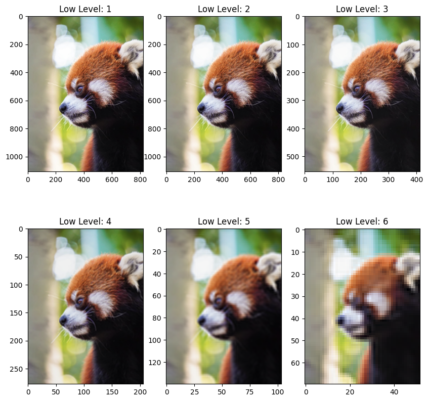
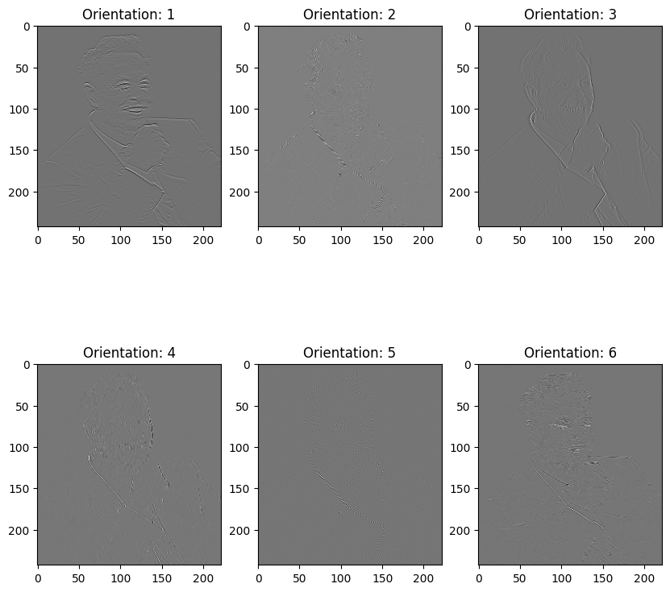

# 0. Introduciton
**🔥First released** implementation of Dual-Tree Complex Wavelet Transformation.  It's open-sourced and under MIT License to be used free.

The **Wavelet Transformation** is getting hotter these days in CV and Series-Analysis, DTCWT is a kind of modification of DWT(Discrete Wavelet Transformation) which contains more orientational details in the high-frequence. Process of DT-CWT is as follows:


Thanks to those works mentioned below, our implementation is supported by torch, which can be computed fast and accelerated by GPUs.

💡**You can now use this function in your own work, it may helps a lot, especially in the aspect of medical images with high-resolution and 3 dimensions.** 

### Suggestions in your own work:
We provide some useful-or-not **suggestions** you can deliver this transform:

1. **Scalar Aspects**: wavelet transform could help you downsample your image with a methematical method, while getting some additional info. You can take some strategies like **Pyramid Feature** or **Multi-Scale Learning** through this method.
2. **Orientation Details**: it can help you capture different orientation information, which helps your network **more explainable** and easy to train(since more info to learn).
3. etc.

*👀Looking forward to updates......👀*

**🚀🚀🚀 Please do not forget to cite our work if you use this implementation! It's really important tu us and we will really appreciate it! 🚀🚀🚀**

**🛰️🛰️🛰️ If you have any suggestions about this repo, pls contact me with my email that posted on my pofile, I will response it as quickly as possible. 🛰️🛰️🛰️**

**🔥🔥🔥 Furthermore, I'm a postgraduate student focusing on CV and Multi-Modality Model, if you have some interest in me or you'd like to find someone to cooperate with in some wonderful projects, do contact me with no doubt. I'm looking for some projects(or PhD Projects with funding) on Robotics or CV-Machine 🔥🔥🔥**


# 1. Installation
You can follow these steps to a quick installation, it will help you construct your enterpreter. **We highly recommend you create a new environment for it of Annaconda or Miniconda**:
```
git clone https://github.com/YaoxinHuang/3D-DTCWT.git
cd 3d-dtcwt
pip install -e .
```

# 2. Brief Examples
Usage promts are all in ```example.py``` that you can check. 

**For Data:** Make sure your input data obeys this format: ``[Batch, Channel, (Depth), Height, Weight]``, D only occurs when you try to take 3D-input.

**For Model:** You should use ```input_dim``` to control the dimension of DTCWT, and use ```J``` to control the number of layers you want.

### 2D Usage
```
dtcwt = DTCWTForward(input_dim=2, J=3)
```
We plot their **low & high** frequency map:
#### Example 1:

-----------------------------------------------------


#### Example 2:

-----------------------------------------------------


### 3D Usage
```
dtcwt = DTCWTForward(input_dim=3, J=3)
```


# 3. TODO:
1. Version 1.0 Serires: complete the apis of forward transform and inverse transform of 3D input.

    a) Version 1.5: complete the inverse transform of 3D input.

2. Version 2.0 Serires: complete the backward function for ```torch.nn```.

# 3. References:
### Codes:
1. [torch-dwt](https://github.com/KeKsBoTer/torch-dwt) by KeKsBoTer
2. [PyWavelets](https://github.com/fbcotter/pytorch_wavelets) by fbcotter
### Papers:
1. 石宏理, & 胡波. (2007). 双树复小波变换及其应用综述. 太赫兹科学与电子信息学报, 5(3), 229-234.

### Recommended References of Wavelet Transforms:
1. https://zhuanlan.zhihu.com/p/535018632
2. https://www.cnblogs.com/wxl845235800/p/10720543.html

